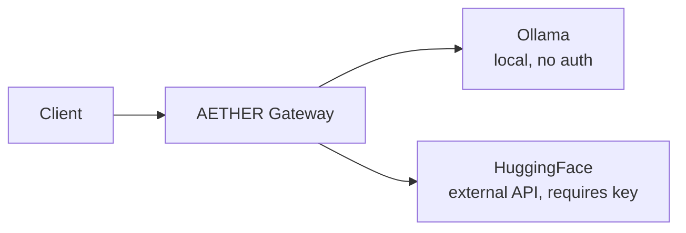
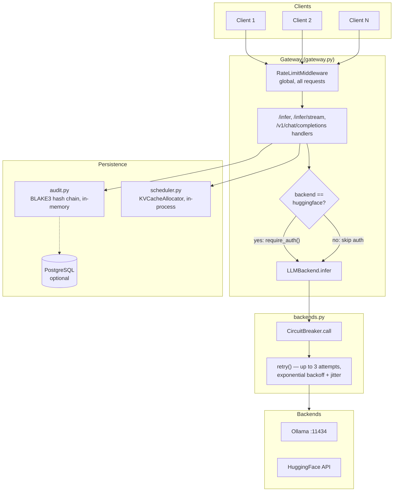
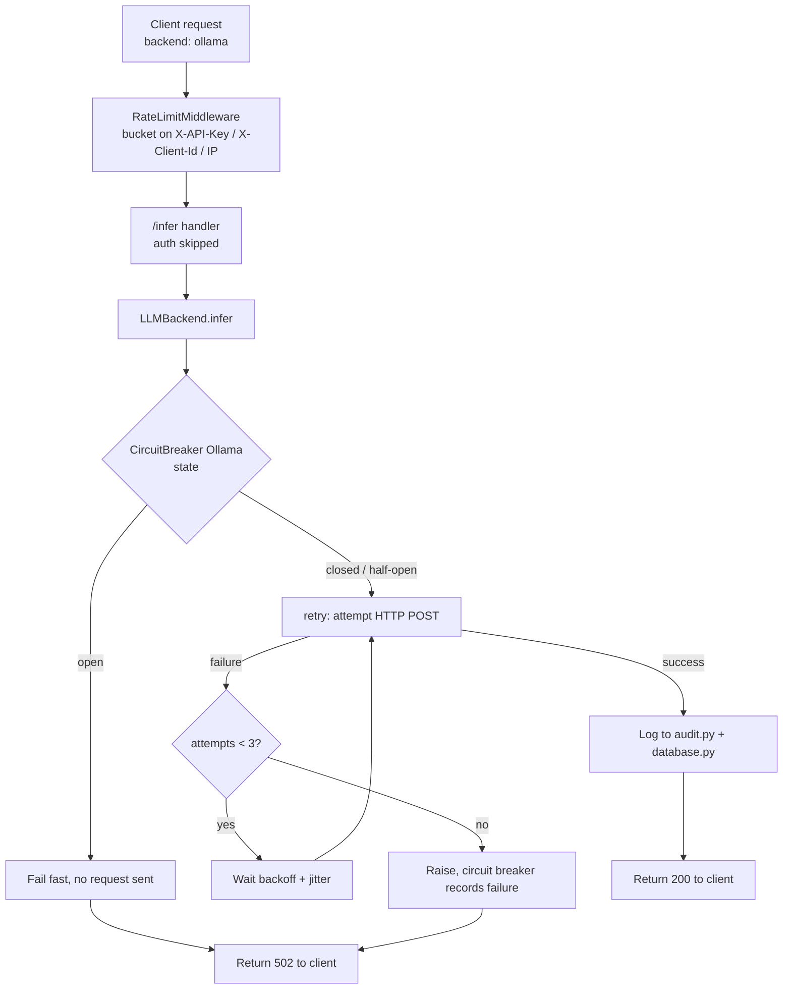
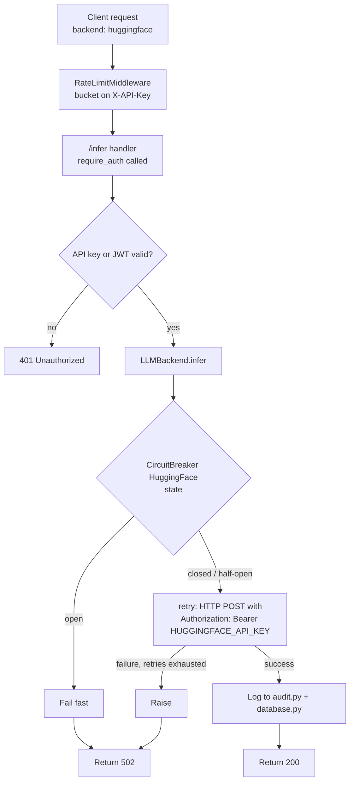
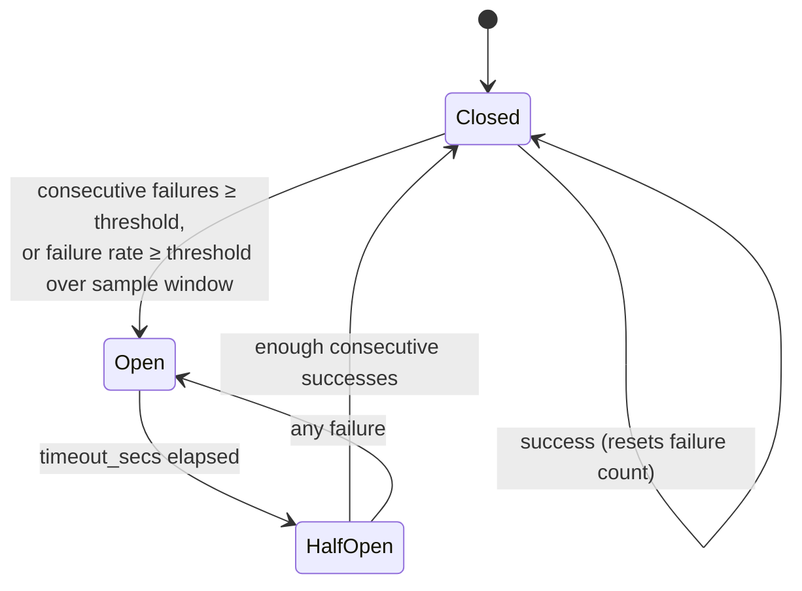
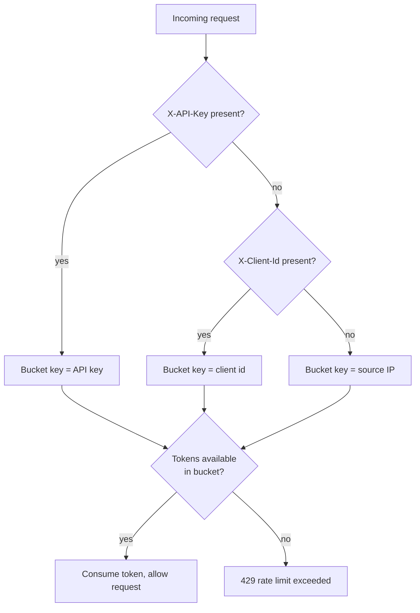
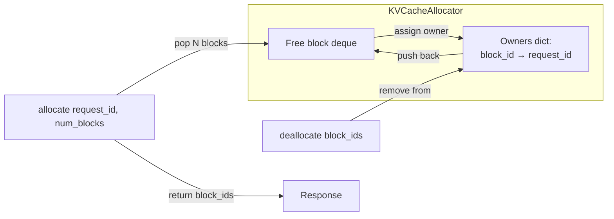

# AETHER Architecture

## What this is

AETHER is a reverse proxy for LLM inference. Nobody talks to Ollama or HuggingFace directly — every client talks to AETHER, and AETHER talks to the actual model backends on their behalf.

```
Client → AETHER → Ollama (local, no external auth)
                 → HuggingFace (external API, needs HUGGINGFACE_API_KEY)
```

AETHER does not train, fine-tune, or improve any model. The text generation quality is entirely whatever Ollama or HuggingFace already produce. What AETHER adds is everything *around* that call: reliability, access control, and observability.

## Diagrams

### System overview



### Layered view

Auth is drawn separately from the global middleware stack because, unlike rate limiting, it is not middleware — it is a per-route dependency invoked conditionally inside the handler, only when `backend == "huggingface"`.



### `/infer` request flow — Ollama backend (default, no auth)



### `/infer` request flow — HuggingFace backend (auth required)



### Circuit breaker state machine (`resilience/circuit_breaker.py`)



### Rate limiter bucket selection (`security.py`)



### KV-cache allocation (`scheduler.py`)

Single-node, in-process only — `_owners` and `_free` are plain Python structures guarded by a thread lock, not shared across machines.



## Why put something in the middle at all

A raw call to Ollama gives you none of the following. AETHER exists to add:

- **Backend choice, explicit per request** — each `/infer` call picks `"ollama"` (default, free, local) or `"huggingface"` (external, costs quota, needs a key). There is no automatic silent fallback between them — a past version of this gateway tried Ollama then silently fell back to HuggingFace, which was removed because it made cost and behavior unpredictable.
- **Resilience** — if a backend is failing, stop hammering it (circuit breaker) instead of piling on load. If a single request fails transiently, retry it with backoff instead of surfacing a hard error immediately.
- **Identity and rate control** — know who is calling, and cap how much they can call, without giving every caller the same unlimited access.
- **A durable record** — a tamper-evident audit trail of inference calls, and optionally persistent logs in PostgreSQL.
- **A shared memory allocator** — a KV-cache block scheduler so multiple concurrent requests can be tracked cleanly on one machine.

## Request flow

### Path A — Ollama (the default, free, local backend)

```
Client
  ↓  POST /infer  { model, prompt, max_tokens, backend: "ollama" }
  ↓  (optional: X-API-Key or X-Client-Id header, used only for rate-limit bucketing)
[RateLimitMiddleware]         → buckets on X-API-Key, else X-Client-Id, else source IP
  ↓
[gateway.py /infer handler]   → backend == "ollama" → require_auth is SKIPPED
  ↓
[LLMBackend.infer(..., backend="ollama")]
  ↓
[CircuitBreaker["Ollama"].call(...)]  → short-circuits immediately if Ollama has been failing
  ↓
[_post_json → retry() with exponential backoff + jitter]
  ↓
Real HTTP call to OLLAMA_ENDPOINT
  ↓
Response flows back up → logged to audit.py (hash chain) and database.py (if PostgreSQL connected)
```

No API key is required on this path. This was a deliberate choice, not an oversight: for a team sharing one GPU box, Ollama itself has no authentication at all, so requiring a key at the gateway to reach an already-unauthenticated backend added friction without adding real security.

### Path B — HuggingFace (external, costs real quota, requires auth)

```
Client
  ↓  POST /infer  { model, prompt, max_tokens, backend: "huggingface" }
  ↓  X-API-Key: sk-alice   ← proves Alice is an authorized teammate, to AETHER only
[RateLimitMiddleware]      → buckets on sk-alice specifically
  ↓
[gateway.py /infer handler] → backend == "huggingface" → require_auth() IS called
  ↓
[ApiKeyValidator.validate()] → checks sk-alice against API_KEYS or the api_keys table → passes or 401s
  ↓
[LLMBackend.infer(..., backend="huggingface")]
  ↓
[CircuitBreaker["HuggingFace"].call(...)]
  ↓
[_hf_infer] → attaches Authorization: Bearer <HUGGINGFACE_API_KEY>   ← your account's key, not Alice's
  ↓
Real HTTP call to HuggingFace's servers
```

Two different keys are in play here, and they never touch each other. `sk-alice` proves Alice's identity to *your* gateway. `HUGGINGFACE_API_KEY` is *your* credential, presented by the gateway to HuggingFace — Alice never sees it, and it is never sent to her.

`/infer/stream` (SSE) follows the same conditional-auth pattern, but only supports the Ollama backend — a HuggingFace streaming request is rejected with `400`, because `_hf_infer` does not implement streaming against HuggingFace's API in this codebase.

## Resilience layer (`aether/resilience/`)

Three independent, composable pieces, each with its own tests:

- **`circuit_breaker.py`** — 3-state (`closed → open → half-open → closed`) per backend. Opens after a threshold of consecutive failures or a sustained failure rate; after a timeout, allows one trial request through (`half-open`); closes again after enough consecutive successes. Prevents a failing backend from being hammered indefinitely.
- **`retry_handler.py`** — exponential backoff with jitter (`initial_backoff * multiplier^attempt`, randomized) on individual HTTP calls inside `_post_json`. Handles transient failures — a dropped connection, a momentary 500 — that a single retry attempt would otherwise surface as a hard error.
- **`timeout_handler.py`** — a reusable `with_timeout()` / `timeout_decorator` wrapping `asyncio.wait_for`. Exists alongside three *configurable* timeout settings (`GATEWAY_TIMEOUT`, `HEALTH_CHECK_TIMEOUT`, `STREAM_TIMEOUT`) that were previously hardcoded in three different places with no single source of truth.

These three are deliberately separate from **bulkhead** (per-backend concurrency limiting) and **distributed KV-cache via Raft/gRPC**, both of which were prototyped and then removed. Bulkhead was cut because a 2-backend gateway with a circuit breaker already prevents hammering a failing backend — a concurrency limiter added no further protection for this scale. Distributed KV-cache was cut twice, for two different reasons: first because the gateway runs as a single process on one machine (nothing to distribute across), and again when "multiple GPUs" was raised — multiple GPUs on *one* machine still share one process's memory, so there is still no network boundary for gRPC or Raft to solve. It would become relevant only if AETHER ever runs as multiple gateway processes across multiple separate machines.

## Authentication — what exists and what doesn't

`security.py`'s `ApiKeyValidator.validate()` accepts either:
- `X-API-Key` header, checked against `.env`'s `API_KEYS` (a static, comma-separated list) or the `api_keys` table in PostgreSQL if connected, or
- `Authorization: Bearer <JWT>`, verified against `JWT_SECRET`.

**Only the API key path is actually usable today.** JWT *verification* exists in the code, but there is no endpoint anywhere that *issues* a JWT — no `jwt.encode(...)` call exists in this codebase. This was a deliberate decision, not an oversight: JWT would add token expiry and self-contained claims, but for an internal team with a small, relatively static set of members, manually creating/revoking API keys via `POST /api/keys` / `DELETE /api/keys/{key}` covers the actual need without the added complexity of a login/issuance flow. If the gateway ever needs self-expiring, per-session tokens instead of long-lived keys, this is the piece to revisit.

`POST /api/keys` requires PostgreSQL to be connected — without it, it returns a clean `503` (this used to be an unhandled crash; fixed). `GET /api/keys` and `DELETE /api/keys/{key}` degrade gracefully to an empty list / `false` instead of erroring, so the gateway's core inference paths are never blocked by a missing database.

## Rate limiting

`RateLimitMiddleware` is a token-bucket limiter applied globally to every request. The bucket key is chosen in this priority order:

1. `X-API-Key`, if present
2. `X-Client-Id`, if present (a lightweight, unauthenticated identity hint)
3. Source IP, as the final fallback

This ordering exists specifically for the "team sharing one GPU box" scenario: if multiple teammates are behind the same office NAT/IP, keying purely on IP would put them all in one shared bucket — one person's burst of traffic could throttle everyone else. `X-Client-Id` lets teammates on the free, unauthenticated Ollama path still get individually isolated rate limits by voluntarily identifying themselves, without requiring a real API key just to use the free backend. If nobody sends either header, the fallback is a shared bucket per IP — a known, accepted limit for fully anonymous calls, not a bug.

## KV-cache scheduler (`scheduler.py`)

A single-node, in-process block allocator (`KVCacheAllocator`) tracking which fixed-size memory blocks are free versus allocated, guarded by a thread lock. `Scheduler` wraps it with a `node_id` and a `cluster_health()` method — the latter reports on this one process only; it does not indicate a real multi-node cluster. `scheduler_api.py` exists as a separate, standalone FastAPI app that could theoretically run the same allocator behind its own HTTP API on a different port, but `gateway.py` never calls it — the `SCHEDULER_MODE=remote` / `SCHEDULER_URL` settings in `config.py` are unused placeholders today, kept intentionally in case the team scales to genuinely separate machines later.

## What has and hasn't been verified

Everything described above involving `/infer`, `/infer/stream`, `/v1/chat/completions`, `/v1/allocate`, `/v1/deallocate`, `/v1/stats`, `/api/keys`, and `/health*` has been exercised live against the running gateway (not just unit-tested in isolation) and is covered by `tests_python/test_gateway_endpoints.py`. This mattered in practice: two real, previously-silent bugs were found this way — `/health` crashed on every call due to calling `.__dict__` on a plain `dict`, and `/infer` returned `502` on every call because it called a circuit breaker method (`.allow()`) that had never existed. Both are fixed and now covered by regression tests.

Not yet verified:
- PostgreSQL's actual write path (`add_api_key`, `log_inference`, `log_audit`, the migration SQL) — only the "not connected" fallback behavior has been tested.
- HuggingFace inference actually succeeding — only the auth gate around it has been tested; no real `HUGGINGFACE_API_KEY` has been exercised in this environment.
- The Kubernetes manifests in `k8s/` — valid YAML, never applied to a real cluster.
- Real concurrent load from multiple simultaneous teammates — everything so far has been tested sequentially, on one machine, against one local Ollama instance.

## Use cases this is built for

- **A team sharing one GPU machine.** Each teammate gets their own API key (or just uses the free Ollama path with an `X-Client-Id`), so one person's heavy usage doesn't silently degrade everyone else's rate limit or availability.
- **Mixing a free local backend with a paid external one deliberately.** Ollama needs no auth and costs nothing; HuggingFace needs a key and costs real quota — the split is explicit per request, not hidden behind automatic fallback.
- **Wanting a record of what happened.** The BLAKE3 audit chain and optional PostgreSQL logging exist for exactly this — "who called what, when, did it succeed."

## What this is explicitly not built for

- **A single person on their own laptop.** For that case, calling `ollama run <model>` directly is simpler and this entire gateway is overhead — no auth, rate limiting, or audit trail is needed when you're the only user.
- **Multiple separate machines, each with their own GPU.** The scheduler and circuit breakers are all single-process, in-memory state. Running AETHER on more than one machine today would mean each instance has its own disconnected view of cache allocation and rate-limit buckets — this would need a real distributed backing store (e.g. etcd) before it's safe, which has not been built.
- **Public, untrusted internet traffic.** There is no self-service signup, no per-tier billing logic, and TLS/mTLS is assumed to be handled by whatever sits in front of this (a reverse proxy, load balancer, or the cluster's ingress) rather than by AETHER itself.
